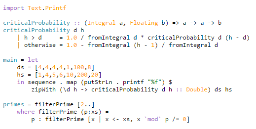
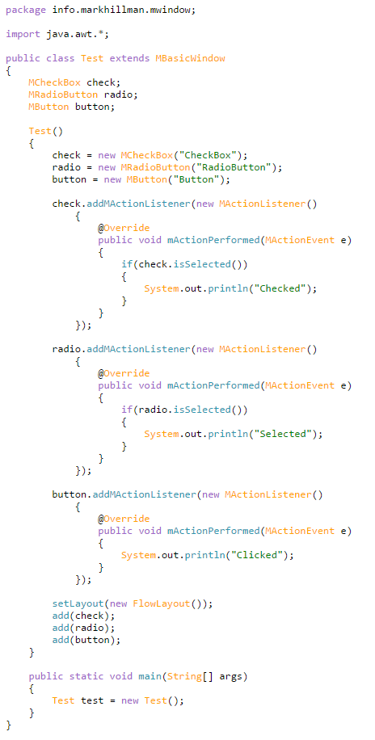

# regex-highlighter

A javascript tool to highlight regex pattern matches in a HTML document via CSS. Whilst this tool is primarily aimed at programming languages syntax highlighting, it can be used with any regular expressions. Highlighted matches from a given regex file will be wrapped in a span tag and then given a class which can be used to style that particular match. There are several supported languages which can be used, or you can create your own custom rules.

## How to Use

### Online Converter

If you don't need to dynamically convert text to its highlighted format, you can use the [online converter](http://markhillman.info/#regex-highlighter) and copy the output into the HTML file. Then all that is needed is to either include the CSS file, or to style the span tags yourself. The online converter allows for all currently supported languages, custom JSON files and single regex lines.

### Adding to a website

Adding the highlighter to a project is very simple! All you have to do is to include the javascript file inside your HTML and run a function from the RegexHighlighter object. To see which functions will best suit your use case, check out the [documentation](https://imitablerabbit.github.io/regex-highlighter/).
Simply put, you can just follow these few steps:
- Download the zip file from github, then move the files to relevant folders somewhere on the server (**Note: the script has to run on a server as it uses AJAX**)
- Add the highlight.min.js script to the html file that you want it to run on using `<script type="text/javascript" src="scripts/highlight.min.js"></script>`.
- Add the syntax.css stylesheet to highlight the matched text using `<link rel="stylesheet" href="styles/syntax.css">`
- Now you can run regex-highlighter with the `loadSyntaxHighlightingByClass()` function. This function is inside the RegexHighlighter class, so first create an instance then call the function, e.g. `new RegexHighlighter().loadSyntaxHighlightingByClass()`. The `loadSyntaxHighlightingByClass()` function takes 2 optional parameters in order to determine which elements should have syntax highlighting added, as well as the folder for where the default language support is. The default options for these are `regex-color` and `./languages/`. This means that only elements which have a class of `regex-color` will be coloured and only the `languages/` folder in the same directory as the script will be searched for the regex support. These can be changed by supplying arguments to the function.
- To tell the regex-highlighter what language it should use, add a class to the same element. The class name should be the same as the language specification file used to define the regex rules.

### Example

```html
<script  type="text/javascript" src="build/highlight.min.js"></script>
<link rel="stylesheet" href="build/syntax.css" charset="utf-8">

    ...    

<pre><code class="syntax-color haskell">import Text.Printf

criticalProbability :: (Integral a, Floating b) => a -> a -> b
criticalProbability d h
    | h > d     = 1.0 / fromIntegral d * criticalProbability d (h - d)
    | otherwise = 1.0 - fromIntegral (h - 1) / fromIntegral d

main = let
    ds = [4,4,4,4,1,100,8]
    hs = [1,4,5,6,10,200,20]
    in sequence . map (putStrLn . printf "%f") $
        zipWith (\d h < criticalProbability d h :: Double) ds hs</code></pre>

    ...

<script type="text/javascript">new RegexHighlighter().loadSyntaxHighlightingByClass("syntax-color");</script>
```

### Documentation

There are a few other public functions which allow for finer control of highlighting text, the documentation for these can be found  [here](https://imitablerabbit.github.io/regex-highlighter/).

## Screenshots

### Haskell



### Java



## Currently supported languages

- Dockerfile
- Java
- Javascript
- Go
- Haskell
- Erlang
- C++
- JSON
- PHP
- Python

## Creating custom JSON files

When creating the custom JSON files, make sure that they are in the following formats:

```json
[
    {
        "type": "class-name",
        "regexes": [
            "regexString1",
            {
                "regexString": "regexString2",
                "captureGroup": 1
            }
        ],
        "precedence": 1
    },
    {
        ...
    }
]
```

Where class-name is class that will attached to the span when the script is run and regex is any regex in a string format. Unfortunately due to JSON not supporting regex notation or raw string, any backslashes in the regex have to be escape e.g \\\\bhello\\\\b.

You can use the testing folder for trying out any new builds and generally editing the source files. This folder also has a way of testing and previewing the regex highlighting that is currently supported, via the [index](src/testing/index.html) webpage.

## Building

To build the src files into a build directory and minimised files you can use the commands from the following table.

| Make Command | Description |
| --- | --- |
| `make` or `make build` | Build all files into a `build` dir. This directory contains the built js files, css files and minimised JSON files for the currently supported language syntax. |
| `make docs` | Builds the documentation locally. |
| `make test` | Builds the src files and copy them into the testing directory. Then the test code can be run on a simple http file server such as an apache server. |
| `make test-fileserver` | Uses the python http server to help run the tests. Stops the needs of having to setup apache and copy over the files. |
| `make clean` | Removes the `build` dir. |
| `make deps-clean` | Removes the `node_modules` folder so that no deps are installed locally. |
| `make docs-clean` | Removes the docs file produced by JSDoc. |
| `make clean-all` | Removes everything that has been built. This will give a completely clean directory only containing src files and testing code. |

## To Do

- Add more tests for each of the different regexes
  - java
  - json
  - PHP
  - python
- Write DOCS.md to fully document this project
- Write documentation for each of the different languages that are currently supported.

## Change Log:

- Add a build script to generate the files in the build directory.
- Added a list of languages supported in the readme.
- Added better testing
  - c++
  - haskell
  - javascript
- Change the json to use an array instead of keys for order preservation
- Add name property to type
- Moved to prototype class structure
- Fix the highlighting within the imports and variables
- Document new regex object
- Add some way to express which capture group is needed in the language data
- Added more robust commenting to the javascript file (came with JSDoc)
- Added some more error checking to the javascript file, mostly for optional arguments
- Added in depth documentation to this project, using JSDoc
- Added a way to add options to the regexes, for example to set the precedent. This was so I can get regex matches with the same precedent, so the longer of the 2 matches will be chosen.
- Updated the duplicate removal for new precedent matching.
- Added a more complex regex duplication detection system
- Fixed java character matching
- Changed to last group pattern matching
- Fixed the haskell function errors
- Created a guide on how to add more languages
- Added Languages:
  - Python
  - PHP
  - basic C++
  - JSON
  - Javascript
  - Java
  - Haskell
- Added main javascript file
- Added support for multiple languages
